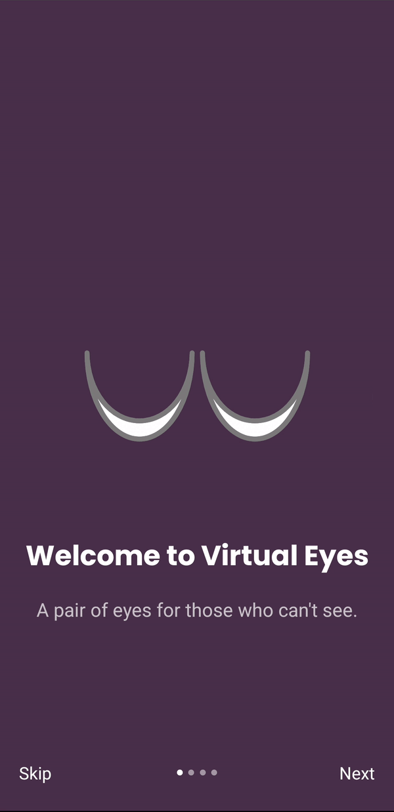
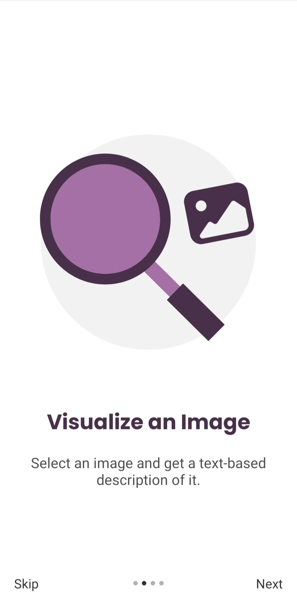
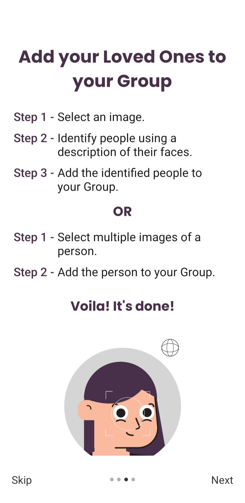
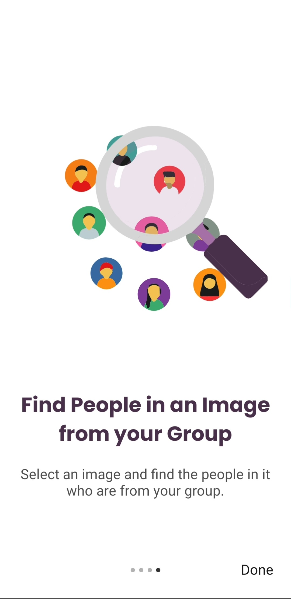

<h1 align="center">Virtual Eyes</h1>
<h3 align="center">
    A pair of eyes for those who can't see.
</h3>
<div align="center">
    
</div>
&nbsp;

<p align="center">
  <a href="https://github.com/Im-Madhur-Gupta/virtual-eyes-frontend/commits/">
    
  </a>
  <a href="https://github.com/Im-Madhur-Gupta/virtual-eyes-frontend/releases">
    
  </a>
</p>

<h2>About The App</h2>

- Virtual Eyes is a small gesture from my side in making images _visible_ to the blind people.
- It does the following -
  - Visualize an image.
  - Identify loved ones in images.
- It was made keeping in mind the needs of blind people and it is Google Talkback friendly.
- It utilizes Azure Cloud Service for face recognition and image visualization.

<h3>Tech Stack</h3>

- React Native
- NodeJS
- MongoDB
- Azure Cloud Services
  - Azure Face API
  - Azure Computer Vision
  - Azure App Service

<h3>Features</h3>

- **Visualize an Image** -

  - Select an image and get a text-based description of it.

  <p align="center">
    
  </p>

- **Detect People from an image** -

  - Add your loved ones to your group.
  - Find people in an image from your group.

  <p float="left" align="middle">
    
    &nbsp;
    
  </p>

## Getting Started

You can run a local build of Virtual Eyes on your Android phone, follow the below steps to do so or you may download the latest build apk from [releases](https://github.com/Im-Madhur-Gupta/virtual-eyes-frontend/releases/) section.

### Prerequisites

- You should have [`NodeJS`](https://nodejs.org/en/) and [`yarn`](https://yarnpkg.com/) installed on your computer.
- You should have an Android Device connected to your computer with adb drivers installed and USB debugging turned on.

  [Follow the expo documentation in case of issues.](https://docs.expo.dev/get-started/installation/)

### Installation

1. ``` cd ./virtual-eyes-frontend ```
2. ```yarn add -g expo-cli```
3. ```yarn```
4. ```expo run:android```

## Usage
https://user-images.githubusercontent.com/76112446/175405739-8884cd55-4ce8-4148-8cd4-5c19084d47c6.mp4

## Future Plans

- [ ] Functionality to delete a specific person from group.
- [ ] Add object detection.
- [ ] Add voice based navigation to make the app more accessible to the blind.

<p align="center">
Made with Love ❤️, Respect 🙏 and Passion 👨🏽‍💻.
<p>
